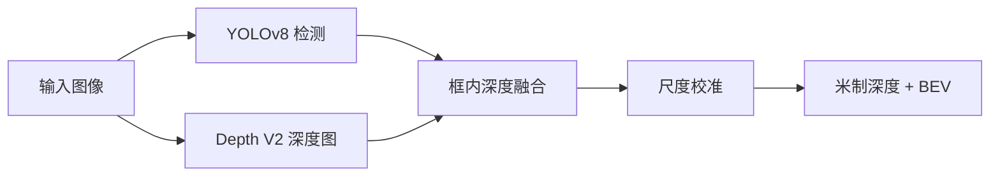

# DepthAware-Det

单目视觉 **3D 感知**系统：将 **YOLOv8** 目标检测与 **Depth Anything V2** 单目深度估计融合，在 2D 检测框内提取深度、经几何尺度校准得到米制距离，并生成 **BEV 鸟瞰图**可视化。

支持 **PyTorch / ONNX Runtime / TensorRT** 三种推理后端，提供命令行实时 Demo 与 **Gradio Web 界面**（图片 / 视频 / 摄像头）。

📄 完整项目说明报告见 [`docs/项目报告.md`](docs/项目报告.md)（用途、技术方案、功能列表，适合课程/答辩文档）。

---

## 功能特性

- **检测 + 深度融合**：框中心区域 IQR 鲁棒深度，多目标联合尺度校准  
- **米制深度**：基于 COCO 类别先验高度与相机焦距  
- **BEV 可视化**：检测框底边中心反投影至地面平面  
- **三档加速**：PyTorch 调试 → ONNX 通用 → TensorRT 最快（本机 Depth ~4ms/帧）  
- **Web Demo**：拖拽图片、上传视频、浏览器摄像头实时预览  
- **工程化**：环境自检、模型缺失提示、Windows 一键启动  

---

## 系统流程



| 步骤 | 模块 | 说明 |
|------|------|------|
| 检测 | `src/detector.py` | 输出 `[x1,y1,x2,y2,conf,cls]` |
| 深度 | `src/depth_estimator.py` | 官方预处理，518×518 输入 |
| 融合 | `src/fusion.py` | 框中心 50% 区域 + 中值 / IQR |
| 校准 | `src/calibration.py` | 焦距 + 物体先验高度 → 尺度因子 |
| BEV | `src/bev.py` | 鸟瞰图渲染 |
| 管道 | `src/pipeline.py` | 串联上述模块 |

---

## 项目结构

```
DepthAware-Det/
├── app.py                 # Gradio Web 入口
├── launch_web.ps1         # 一键启动（含环境检查）
├── 启动网页.bat
├── config/
│   └── env.example.ps1    # 本地路径模板（复制为 env.ps1）
├── checkpoints/           # 深度权重（Git 忽略 *.pth）
├── models/                # ONNX / TensorRT（Git 忽略）
├── depth_anything_v2/     # Depth V2 推理代码（已包含）
├── src/                   # 核心库
├── scripts/               # 工具脚本
├── data/                  # 测试图、KITTI 数据
└── outputs/               # 运行输出
```

---

## 快速开始

### 1. 环境

```bash
conda create -n depthaware python=3.10 -y
conda activate depthaware

# 按显卡选择 CUDA 版本，示例：CUDA 12.1
pip install torch torchvision --index-url https://download.pytorch.org/whl/cu121
pip install -r requirements.txt
```

> 仓库已包含 `depth_anything_v2/`，无需再克隆官方仓库。若目录缺失，可运行 `python scripts/setup_depth_module.py`。

### 2. 模型文件（克隆后必做）

Git **不包含**大文件，请在本机生成：

```bash
python scripts/download_weights.py      # checkpoints/depth_anything_v2_vits.pth
python scripts/export_onnx.py --all     # models/*.onnx
python scripts/build_trt.py --all       # models/*_fp16.engine（可选，需 TensorRT）
python scripts/check_env.py             # 检查环境与模型是否齐全
```

详见 [`checkpoints/README.md`](checkpoints/README.md)、[`models/README.md`](models/README.md)。

### 3. 启动 Web 界面（推荐）

**Windows：**

```text
双击  启动网页.bat
```

或：

```powershell
.\launch_web.ps1
```

浏览器访问：**http://127.0.0.1:7860**

- 推理后端：**TensorRT**（最快）/ ONNX / PyTorch  
- 支持图片推理、视频处理、摄像头实时流  

首次使用请复制 `config/env.example.ps1` → `config/env.ps1`，按本机修改 `TRT_ROOT` 等路径。

### 4. 命令行 Demo

```bash
# 单张图
python scripts/test_single_image.py --image data/test.jpg

# 摄像头（PyTorch）
python scripts/run_realtime.py --source 0 --focal 800

# ONNX 加速
python scripts/run_realtime.py --source 0 --onnx

# TensorRT 全链路（最快）
python scripts/run_realtime.py --source 0 --trt

# 隔帧深度 + 缩小 YOLO 输入以提速
python scripts/run_realtime.py --source 0 --trt --depth-every 2 --imgsz 512
```

| 按键 / 参数 | 作用 |
|-------------|------|
| `d` | 切换深度热力图画中画（实时模式） |
| `q` | 退出 |
| `--focal` | 相机焦距（像素），默认 800 |
| `--depth-every N` | 每 N 帧更新一次深度图 |
| `--save path` | 保存输出视频 |

---

## 推理后端对比

| 后端 | 命令 / Web 选项 | 依赖文件 | 适用场景 |
|------|-----------------|----------|----------|
| PyTorch | 默认 / `torch` | `.pth` + `yolov8s.pt` | 调试、首次运行 |
| ONNX | `--onnx` | `models/*.onnx` | 无 TensorRT 时的 GPU 加速 |
| TensorRT | `--trt` | `models/*_fp16.engine` | 最低延迟、实时 Demo |

Web 界面与 `run_realtime.py` 使用同一套 `create_detector` / `create_depth_estimator` 接口。

---

## TensorRT 构建（Windows）

```powershell
# 将 TensorRT 加入 PATH（路径按本机安装位置修改）
$env:PATH = "D:\Program Files\TensorRT-8.6.1.6\lib;D:\Program Files\TensorRT-8.6.1.6\bin;" + $env:PATH

# 一键：先 YOLO，再 Depth
.\scripts\build_trt.ps1

# 或分步
python scripts/build_trt.py --yolo
python scripts/build_trt.py --depth --simplify
```

生成文件：

- `models/yolov8s_fp16.engine`  
- `models/depth_anything_v2_vits_fp16.engine`  

> 路径含中文时，`build_trt.py` 会自动将 ONNX 复制到 `%TEMP%` 再构建。  
> 可选：运行 `.\scripts\setup_windows_once.ps1` 将 TensorRT 写入用户 PATH，新终端永久生效。

---

## KITTI 评估

将 KITTI 样本放入：

```text
data/kitti/image_2/000000.png
data/kitti/calib/000000.txt
data/kitti/velodyne/000000.bin
```

```bash
python scripts/eval_kitti.py --kitti-root data/kitti --limit 50 --backend trt
```

`--backend` 可选：`torch` / `onnx` / `trt`。输出有 / 无几何校准的 `abs_rel`、`rmse`。

---

## 脚本一览

| 脚本 | 说明 |
|------|------|
| `app.py` | Gradio Web 服务 |
| `scripts/check_env.py` | CUDA / TRT / ONNX / 模型文件自检 |
| `scripts/download_weights.py` | 下载 Depth V2 权重 |
| `scripts/export_onnx.py` | 导出 YOLO + Depth ONNX |
| `scripts/build_trt.py` | 构建 TensorRT engine |
| `scripts/run_realtime.py` | 摄像头 / 视频实时 Demo |
| `scripts/test_single_image.py` | 单图测试 |
| `scripts/eval_kitti.py` | KITTI 稀疏深度评估 |
| `scripts/push_github.ps1` | 首次推送 GitHub 辅助 |

---

## 常见问题

| 现象 | 处理 |
|------|------|
| `No module named depth_anything_v2` | 确认根目录存在 `depth_anything_v2/`，或运行 `setup_depth_module.py` |
| 缺少 `.onnx` / `.engine` | 运行 `check_env.py`，按提示执行 export / build |
| YOLO 日志写 PyTorch 但加载 `.engine` | 实际为 TensorRT，以 `Loading ... for TensorRT inference` 为准 |
| CUDA OOM | 使用 `vits`、减小 `--imgsz` 或 `--depth-every 2` |
| 深度图异常（全白/全黑） | 必须使用官方预处理，勿简单 `/255` |
| FPS 偏低 | 优先 `--trt`；Web/CLI 均可 `--depth-every 2` |
| 米制深度偏差大 | 调整 `--focal`；KITTI 使用标定内参 |

---

## 技术栈

- [Ultralytics YOLOv8](https://github.com/ultralytics/ultralytics)  
- [Depth Anything V2](https://github.com/DepthAnything/Depth-Anything-V2)  
- ONNX Runtime · TensorRT · OpenCV · Gradio  

---

## 许可证与说明

- Depth Anything V2 部分遵循其官方仓库许可。  
- 本项目仅供学习与研究；部署到实际道路场景需自行验证安全性。  

---

## 克隆仓库

```bash
git clone https://github.com/<你的用户名>/DepthAware-Det.git
cd DepthAware-Det
# 然后按「快速开始」安装依赖并生成模型
```

首次推送 GitHub：

```powershell
.\scripts\push_github.ps1 -UserName <你的GitHub用户名>
```
